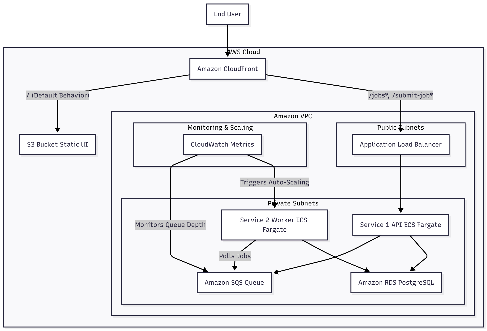

Here is a High-Level Design (HLD) document for the solution, formatted in markdown.

---

# High-Level Design: AWS Cloud-Native Application

This document outlines the high-level design for deploying a three-tier application on AWS. The architecture prioritizes managed services, scalability, cost-effectiveness, and full automation via Infrastructure as Code (IaC).

---

## 1. Solution Architecture

### 1.1. Architectural Flow

The system operates through a decoupled, event-driven flow:

1.  **User Access:** The end-user accesses the UI via **Amazon CloudFront**, which serves static content (HTML, CSS, JS) from an **Amazon S3** bucket.
2.  **API Request:** The UI, running in the user's browser, sends API requests to an **Application Load Balancer (ALB)**.
3.  **Backend Processing (Service 1):** The ALB routes traffic to **Service 1**, a container running on **Amazon ECS with AWS Fargate**. This service handles the initial request.
4.  **Job Queuing:** Service 1 processes the request and sends a job message to an **Amazon SQS (Simple Queue Service)** queue.
5.  **Job Execution (Service 2):** **Service 2**, also running on **ECS with Fargate**, polls the SQS queue for messages. As messages arrive, it processes the long-running jobs.
6.  **Database:** Both Service 1 and Service 2 communicate with a central **Amazon RDS** database (e.g., PostgreSQL or MySQL) for job management and state.
7.  **Auto Scaling:** **Amazon CloudWatch** monitors the SQS queue depth. If the number of messages (`ApproximateNumberOfMessagesVisible`) exceeds a threshold, it triggers **ECS Service Auto Scaling** to launch more tasks of Service 2. As the queue empties, it scales the tasks back down, even to zero.

### 1.2. Core Components

| Component | AWS Service(s) | Purpose |
| :--- | :--- | :--- |
| **UI** | Amazon S3, Amazon CloudFront | Hosts and distributes static frontend assets globally. |
| **Backend API** | Amazon ECS (Fargate), Application Load Balancer | Service 1: Receives API requests and enqueues jobs. |
| **Messaging** | Amazon SQS | Decouples Service 1 from Service 2; provides a buffer for jobs. |
| **Job Processor**| Amazon ECS (Fargate), ECS Auto Scaling | Service 2: Processes jobs from the SQS queue; scales on queue depth. |
| **Database** | Amazon RDS | Provides a managed relational database for job management. |
| **Container Registry**| Amazon ECR | Stores the Docker images for Service 1 and Service 2. |
| **Networking** | Amazon VPC | Provides a secure, isolated network for all resources. |
| **Monitoring** | Amazon CloudWatch | Collects logs and metrics; triggers scaling alarms. |
| **Security** | AWS IAM | Manages fine-grained permissions for all services. |
| **CI/CD** | AWS CodePipeline, CodeBuild, CodeDeploy | Automates the build, test, and deployment of containers. |

---

## 2. Key Design Decisions

### 2.1. Compute: Serverless Containers (AWS Fargate)

* **Decision:** Use **Amazon ECS with the Fargate launch type** instead of managing EC2 instances.
* **Rationale:**
    * **No Server Management:** Eliminates the need to patch, scale, or manage the underlying operating system.
    * **Cost-Effective:** You pay only for the vCPU and memory consumed by your tasks, which is ideal for the variable workload of Service 2.
    * **Rapid Scaling:** Fargate can provision container tasks quickly, which is essential for responding to SQS queue-depth spikes.

### 2.2. Decoupling: Amazon SQS

* **Decision:** Use an **SQS queue** to separate the backend API (Service 1) from the job processor (Service 2).
* **Rationale:**
    * **Resilience:** If Service 2 fails or scales down, jobs are safely held in the SQS queue and will be processed when Service 2 recovers.
    * **Scalability:** Allows Service 1 and Service 2 to scale independently. Service 1 can accept millions of requests, while Service 2 scales based on its processing capacity.
    * **Asynchronicity:** Allows Service 1 to respond to the user immediately ("Job accepted") without waiting for the long-running task to complete.

### 2.3. Scalability: SQS-Based Scaling

* **Decision:** Configure **ECS Service Auto Scaling** for Service 2 based on the SQS queue depth.
* **Rationale:** This directly addresses the requirement for "frequent upscaling and downscaling." The number of active tasks will always be proportional to the work that needs to be done. This is the most cost-effective scaling method, as the service can scale to zero tasks when the queue is empty.

### 2.4. Graceful Shutdowns

* **Decision:** Configure a `stopTimeout` period in the ECS task definitions for Service 2.
* **Rationale:** To ensure jobs "don't terminate prematurely" during a scale-down event, this setting gives the container time to finish its current job before the task is fully stopped by ECS.

---

## 3. Deployment & Automation

### 3.1. Infrastructure as Code (IaC)

All cloud infrastructure will be defined and managed using **Terraform**. This ensures consistent, repeatable, and version-controlled environments. The Terraform code will be structured into reusable modules:

* `modules/vpc`
* `modules/security` (Security Groups)
* `modules/iam` (Roles and Policies)
* `modules/database` (RDS)
* `modules/messaging` (SQS)
* `modules/frontend` (S3 and CloudFront)
* `modules/ecs_cluster` (Cluster, ECR Repos, Log Groups)
* `modules/ecs_service` (A reusable module for deploying Service 1 and Service 2)

### 3.2. Containerization & CI/CD

1.  **Containerization:** Service 1 and Service 2 will each be packaged as a Docker container using a `Dockerfile` that includes the required Java environment.
2.  **CI/CD Pipeline:** An **AWS CodePipeline** will automate the deployment:
    * **Trigger:** On a code commit to the repository.
    * **Build:** **AWS CodeBuild** uses the `Dockerfile` to build the container image.
    * **Store:** The new image is pushed to **Amazon ECR**.
    * **Deploy:** **AWS CodeDeploy** (or the built-in ECS rolling update) updates the ECS service to use the new image, enabling zero-downtime deployments.
